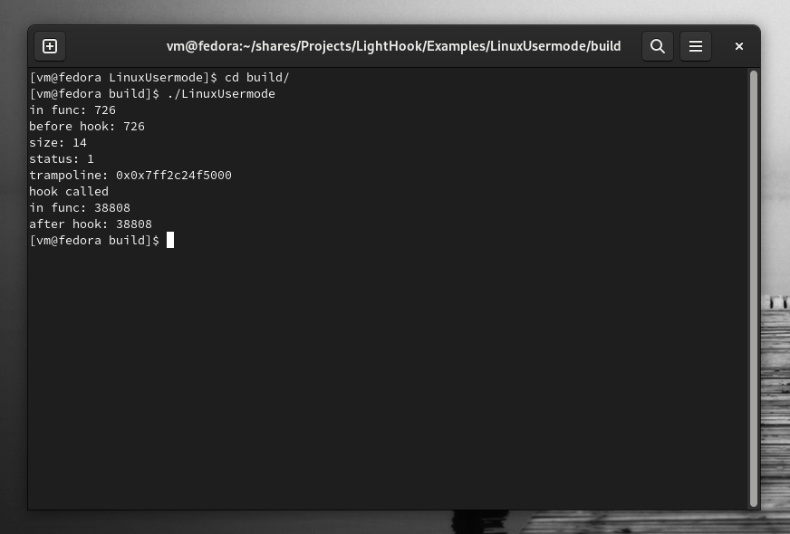
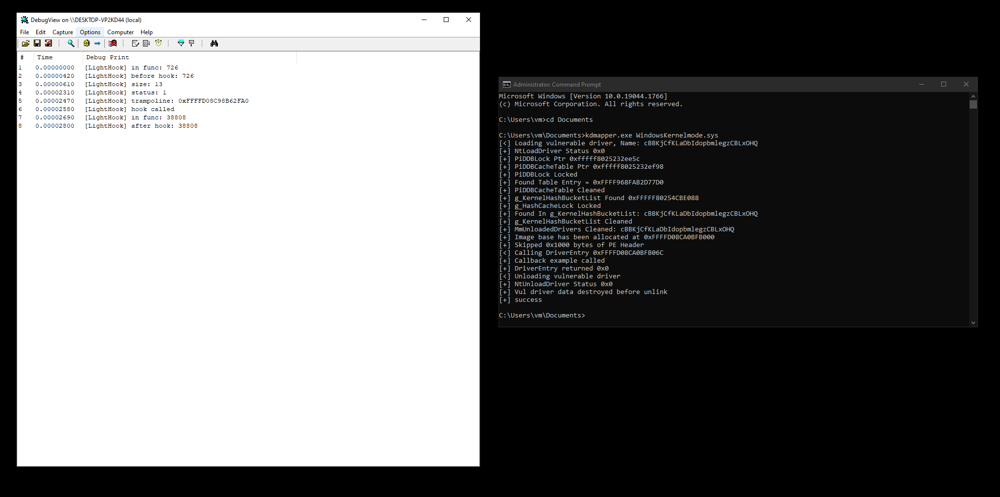
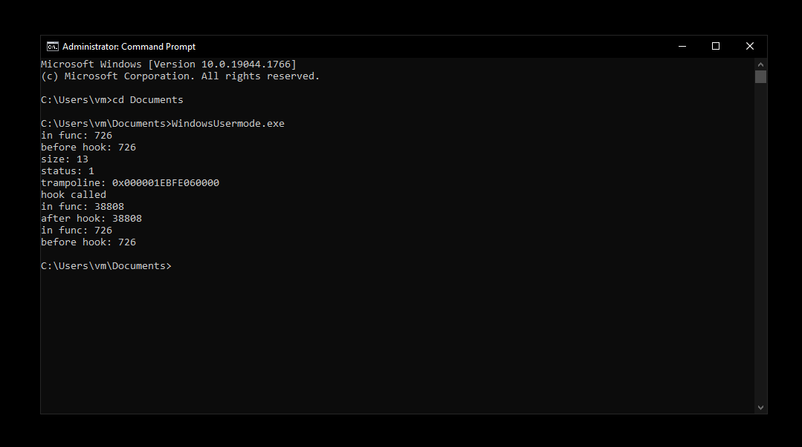
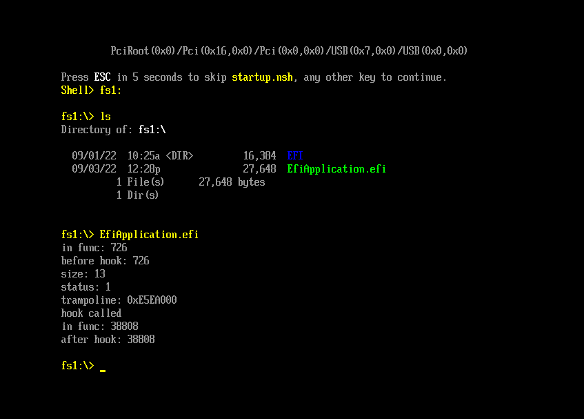

Single-header, minimalistic, cross-platform hook library written in pure C.

## But... why?
While other well-written libraries that do exactly the same already exist, I wanted to have something simple that would not use an entire disassembler engine which can sometimes be painful to include in a project. 

**Pros of this library:**
- Written in pure C
- No dependencies (no full disassembler engine)
- Single header
- Works in both kernelmode/usermode
- Cross-platform (Windows/Linux/EFI)
- Easily portable (3 functions to allocate/free/protect memory that are platform specific)

**Cons of this library:**
- Breaks when a function starts with unsupported instructions (ex. AVX)

## Showcase

